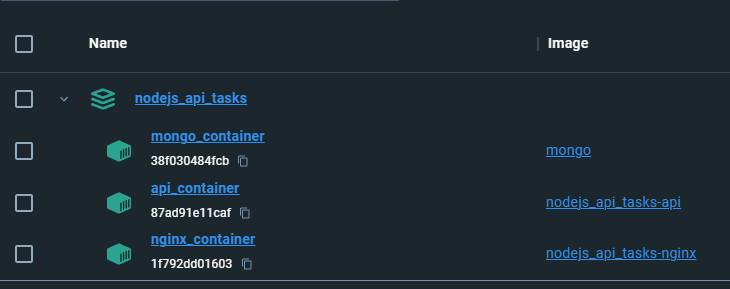
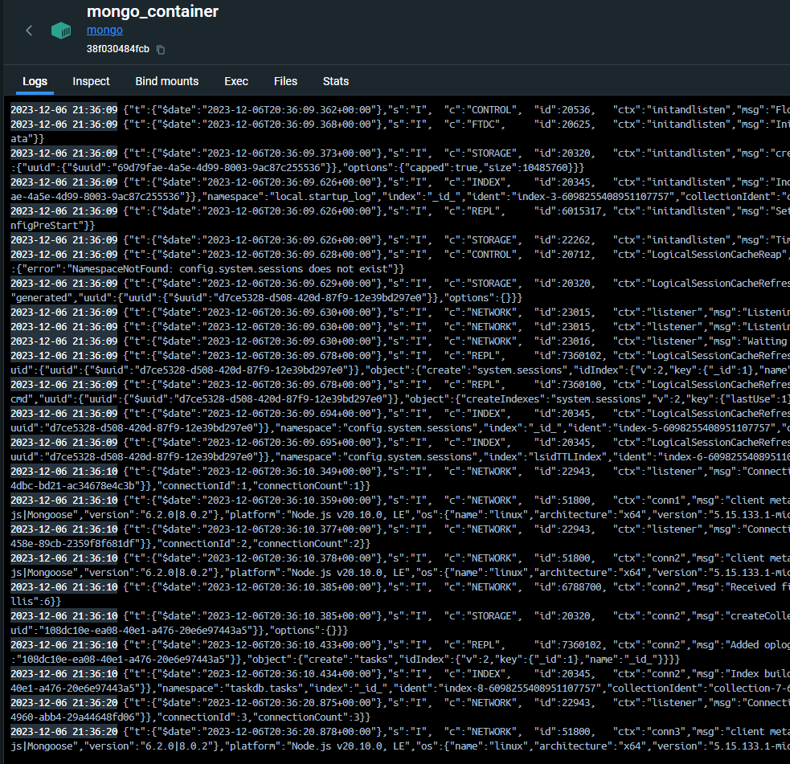
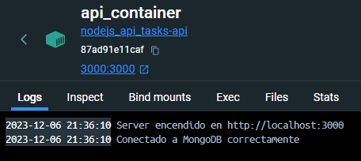
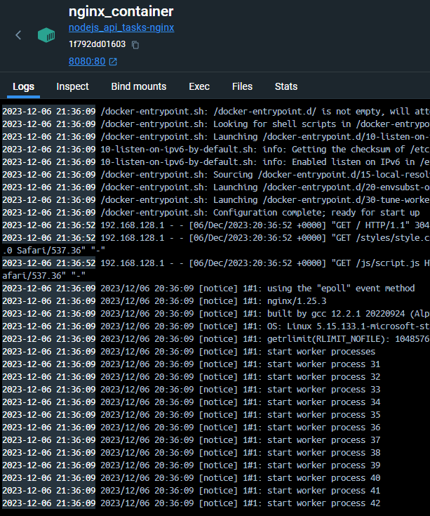
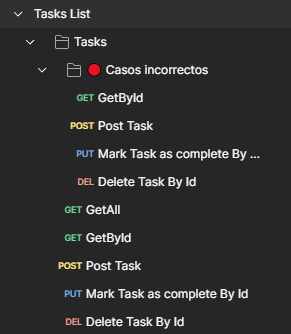
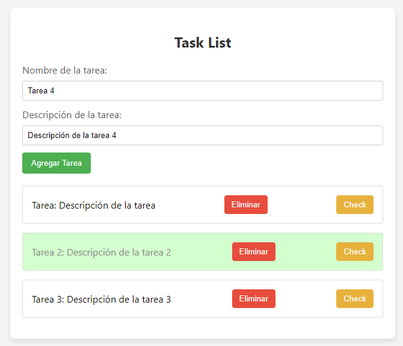

# nodejs_api_tasks
Aplicación API en Node JS junto a base de datos Mongo DB y una web para interactuar. Cuenta con 3 Dockerfile y un Docker-Compose para desplegar.

## Estructura de Carpetas
- 📁 **images**: Contiene imágenes que ilustran los diferentes contenedores y aspectos esenciales del proyecto.
- 📁 **js**: Contiene el código JavaScript utilizado en la interfaz web.
- 📁 **styles**: Almacena los estilos utilizados en la interfaz web.
- 📁 **node_modules**: Directorio que contiene las dependencias del proyecto.

## Contenedores
### Contenedores

  

Panorama general que muestra todos los contenedores en interacción.

### 1. Contenedor Mongo

  

Visualización del contenedor de MongoDB, una parte integral del sistema.

### 2. Contenedor API

  

Imagen representativa del contenedor API.

### 3. Contenedor web (Nginx)

  

Representación visual del contenedor Nginx, crucial para el funcionamiento fluido del proyecto.

## Postman

  

Captura de Postman para ilustrar la interacción con la API. La colección viene incluida en el proyecto.

## Web

Vista previa de la interfaz web del proyecto.
